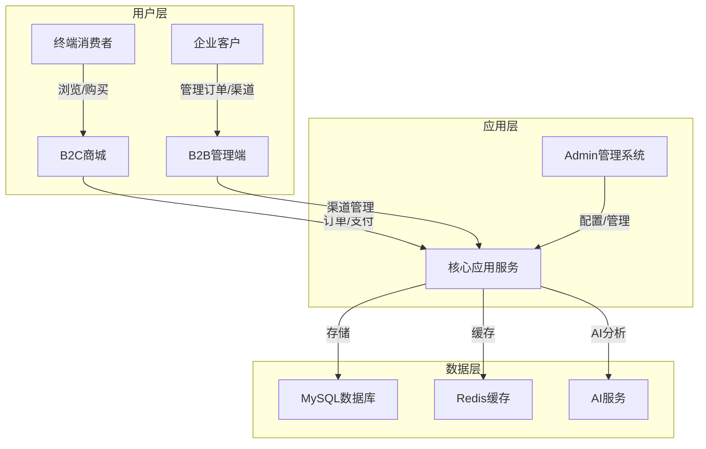

# 用户使用指南

## 📋 系统概述

Crestue OmniBOP 是一个一体化商业运营平台，包含三个核心系统：

1. **Admin 管理系统**：后台管理系统，用于管理商品、订单、用户等核心业务数据
2. **B2C 商城**：面向终端消费者的在线购物平台
3. **B2B 管理端**：面向企业客户的渠道管理平台

## 🏗️ 业务逻辑与数据流

### 系统架构关系

### 核心业务流程

#### 1. 商品管理流程
- **Admin系统**：管理员添加/编辑商品信息
- **数据流**：Admin → 核心应用 → 数据库 → B2C/B2B系统显示

#### 2. 订单处理流程
- **B2C商城**：消费者下单
- **B2B管理端**：企业客户下单
- **数据流**：用户下单 → 核心应用 → 订单处理 → 数据库 → Admin系统查看

#### 3. 库存管理流程
- **Admin系统**：管理库存
- **数据流**：库存更新 → 核心应用 → 数据库 → B2C/B2B系统同步

#### 4. 客户管理流程
- **B2C商城**：消费者注册/登录
- **B2B管理端**：企业客户管理
- **数据流**：用户操作 → 核心应用 → 数据库 → Admin系统管理

## 🚀 系统使用指南

### 1. Admin 管理系统

#### 登录与访问
- **访问地址**：http://localhost:5173
- **默认账号**：admin / admin123

#### 主要功能
- **商品管理**：添加、编辑、删除商品
- **订单管理**：查看、处理订单
- **用户管理**：管理系统用户和权限
- **库存管理**：监控和管理库存
- **数据分析**：查看业务数据报表

#### 操作流程
1. 登录管理系统
2. 进入对应功能模块
3. 执行相应操作
4. 保存并同步数据

### 2. B2C 商城

#### 访问地址
- **商城首页**：http://localhost:8080

#### 主要功能
- **商品浏览**：浏览商品分类和详情
- **购物车**：添加商品到购物车
- **下单支付**：完成订单并支付
- **会员中心**：管理个人信息和订单

#### 操作流程
1. 访问商城首页
2. 浏览商品并添加到购物车
3. 进入购物车确认订单
4. 选择支付方式完成支付
5. 在会员中心查看订单状态

### 3. B2B 管理端

#### 访问地址
- **管理端**：http://localhost:3000

#### 主要功能
- **渠道管理**：管理多级渠道
- **价格策略**：设置渠道价格
- **订单管理**：处理企业订单
- **库存协同**：与供应商协同库存

#### 操作流程
1. 登录B2B管理端
2. 管理渠道和价格策略
3. 处理企业订单
4. 查看库存和销售数据

## 📊 数据同步机制

1. **实时同步**：核心业务数据（如订单、库存）采用实时同步
2. **定时同步**：非实时数据（如报表数据）采用定时同步
3. **缓存机制**：使用Redis缓存提高系统响应速度

## 🔒 安全注意事项

1. **密码安全**：定期更换密码，使用强密码
2. **权限管理**：根据角色分配适当的权限
3. **数据备份**：定期备份数据库
4. **访问控制**：限制系统访问IP和时间

## 🆘 常见问题

### 1. 系统登录问题
- **问题**：无法登录系统
- **解决**：检查账号密码是否正确，联系管理员重置密码

### 2. 订单处理问题
- **问题**：订单状态更新失败
- **解决**：检查网络连接，联系技术支持

### 3. 数据同步问题
- **问题**：数据不同步
- **解决**：刷新页面，检查系统状态

### 4. 系统性能问题
- **问题**：系统响应慢
- **解决**：清理缓存，优化浏览器

## 📞 技术支持

- **联系邮箱**：549057226@qq.com
- **技术文档**：查看项目文档目录
- **系统日志**：检查系统日志获取错误信息

---

**Crestue OmniBOP** - 让商业运营更简单、更智能！